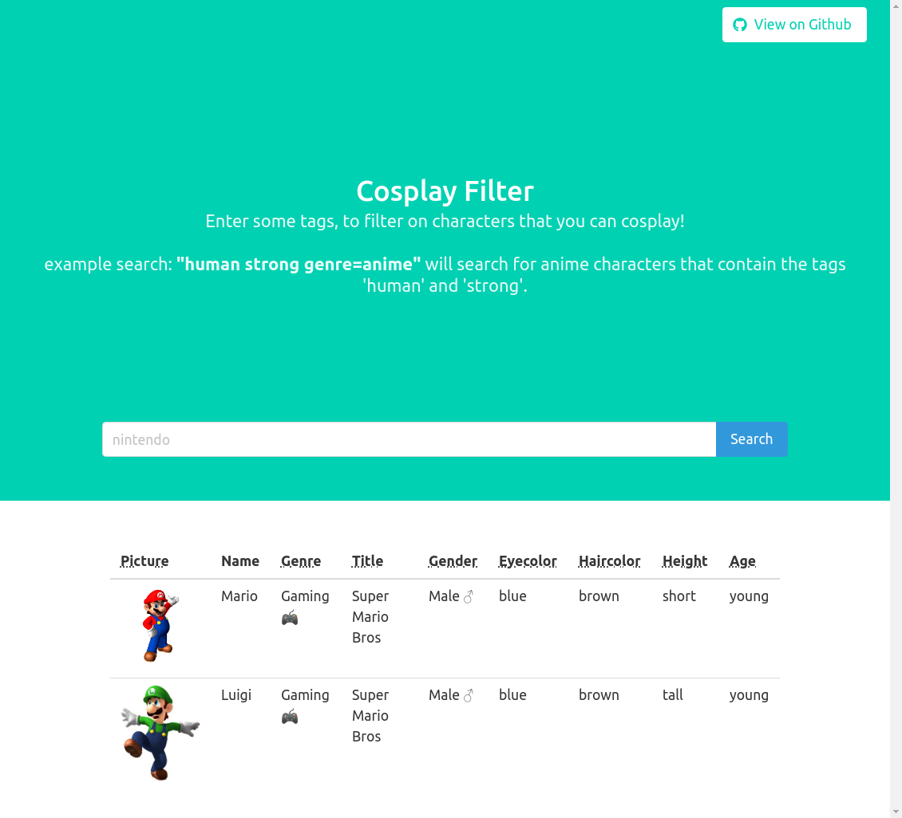

# Cosplay Filter



## About The Project

This project is a website to filter anime/video/tv characters based on some
character-specific tags and properties.

### Technologies

* TypeScript
* Node.js
* Express.js
* MySQL
* Bulma.css

This project relies heavily on Full-text-search to return ranked queries.

### Installation

1. Setup the project

    ```sh
    git clone https://github.com/lepasq/cosplay-filter.git
    cd cosplay-filter
    npm install
    tsc public/js/script.ts
    ```

2. Next you need to set up your MySQL server, fill in your environment variables 
and run `schema.sql`. As an example, you should have a look at `.env`:

    ```sh
    #.env
    DB_PORT=3306
    PORT=4000
    USR=root
    HOST=localhost
    DATABASE=Cosplay
    PASSWORD=12345678
    CONNECTION_LIMIT=20
    ```

3. Next you need to change the path of your `.csv` files in the file `src/models/schema.sql` to your local path.


4. Finally, start the server

    ```sh
    npm start
    ```

### Usage

Example: `human strong genre=amine` will query all anime characters with the
tags `human` and `strong` will query all anime characters with the
tags `human` and `strong`.

It is also possible to use MySQL query specific
[operators]('https://www.w3resource.com/mysql/mysql-full-text-search-functions.php'),
like `+` to indicate that a word must be present in each row, or `-`
to indicate that a word must not be present in a row.

